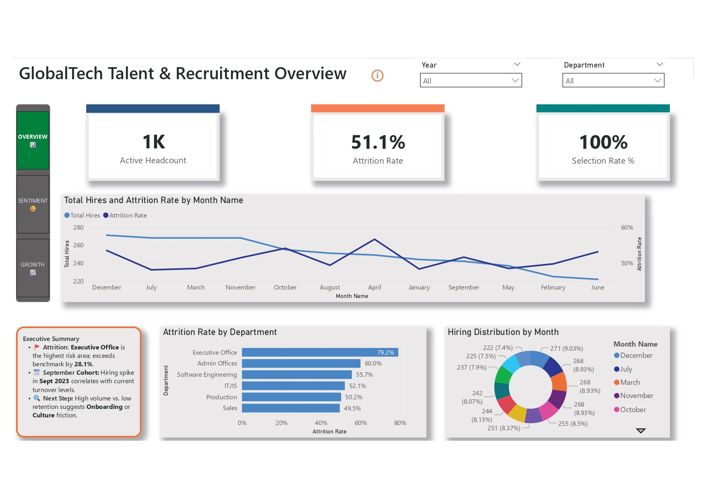
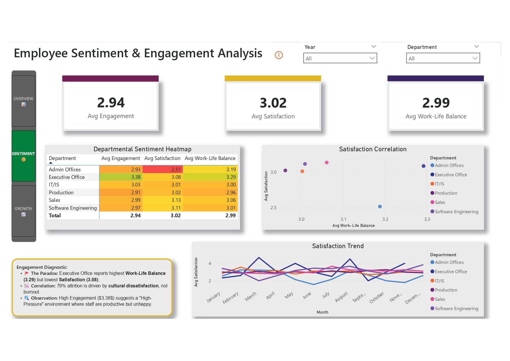
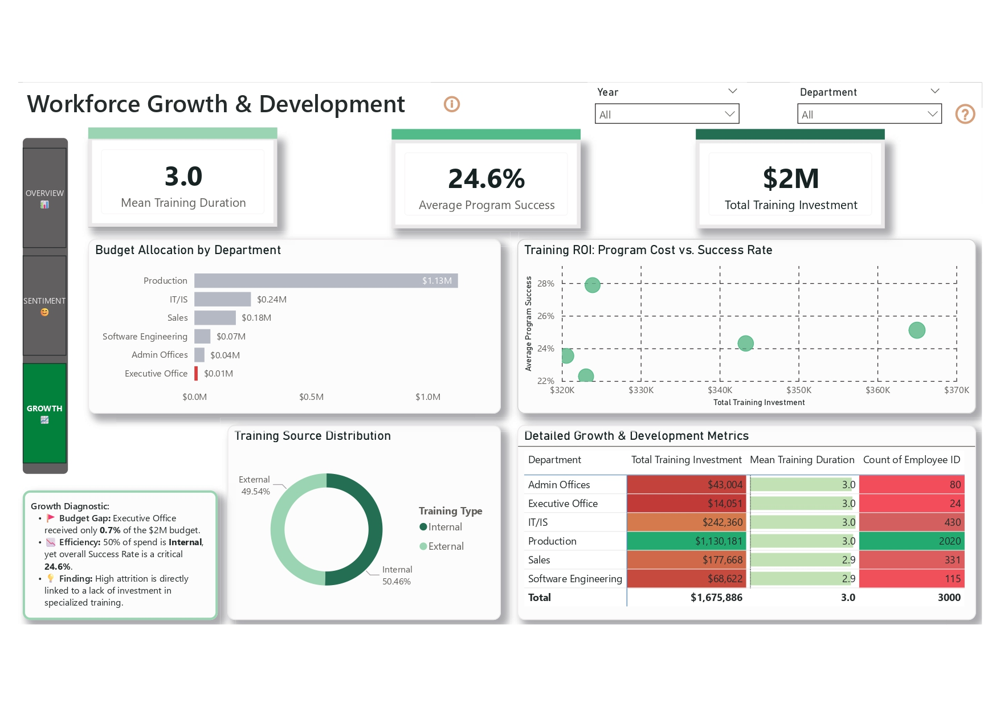

# HR-Analytics-BI-Portfolio
Executive HR Intelligence Suite: Analyzing Attrition &amp; Training ROI using Power BI and Kaggle Datasets.
# Executive HR Intelligence Suite 📊

## 🏢 Business Case: The Executive Attrition Mystery
This project focuses on the "GlobalTech" dataset, where I identified a critical **79.2% attrition rate** within the Executive Office. As a **Training & Development Officer**, I utilized BI tools to correlate turnover with a massive **$2M investment gap**.

## 🚀 Project Gallery

| Page 1: Retention Overview | Page 2: Sentiment Analysis | Page 3: Growth & ROI |
| :---: | :---: | :---: |
|  |  |  |
| *Identifying high-risk departments.* | *Diagnosing the "Satisfaction Paradox".* | *Exposing the $2M budget disparity.* |

  
🔍 Click here for a Technical Walkthrough of the Dashboard

  ### Page 1: Retention & Attrition Overview
  - **Goal:** Identify "where" the problem is.
  - **Key Visual:** The Departmental Attrition Heatmap.
  - **Insight:** Executive Office turnover is 79.2%, significantly higher than the company average.

  ### Page 2: Sentiment & Culture
  - **Goal:** Identify "why" the problem is happening.
  - **Key Visual:** Scatter plot of Work-Life Balance vs. Satisfaction.
  - **Insight:** Discovered that flexibility is high, but cultural engagement is low.

  ### Page 3: Growth & Development ROI
  - **Goal:** Provide a financial solution.
  - **Key Visual:** Budget Allocation vs. Program Success Matrix.
  - **Insight:** Proved the $14k investment in the Executive Office is insufficient for retention.

## 🛠️ Technical Stack & Skills
- **Tool:** Power BI Desktop
- **Data Source:** [Synthetic Employee/HR Dataset (Kaggle)](https://www.kaggle.com/datasets/ravendersinghrana/employeedataset)
- **Modeling:** Star Schema with 4 relational tables.
- **DAX:** Developed measures for Attrition Rate, Engagement Heatmaps, and Training ROI.
- **UX/UI:** Custom navigation rail and synchronized cross-page filtering.

## 📈 Key Insights
1. **Investment Gap:** The Executive Office received <1% of the total training budget despite being the highest-risk department.
2. **Satisfaction Paradox:** High work-life balance (3.29) vs. low cultural satisfaction (3.08) identified through sentiment mapping.

## 👤 Author
**Fabrice Achu Ngando** *Training & Development Officer | Data & BI Analyst* I specialize in bridging the gap between human capital and data-driven strategy. I am currently seeking opportunities in **Germany 🇩🇪 | UAE 🇦🇪 | Cameroon 🇨🇲 | Canada 🇨🇦** where I can apply my expertise in HR Intelligence and Power BI.

🔗 **Connect with me on LinkedIn:** [linkedin.com/in/fabrice-achu-ngando](https://www.linkedin.com/in/fabrice-achu-ngando/)  

